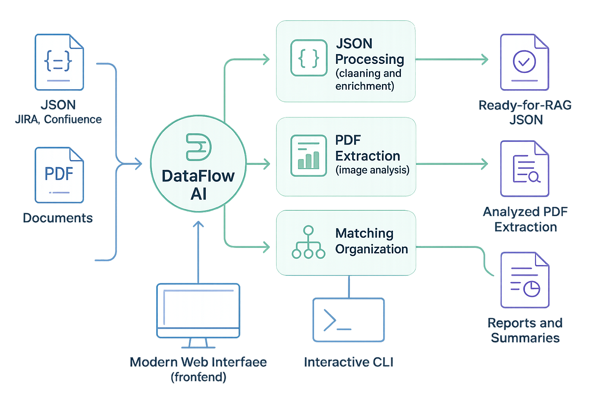
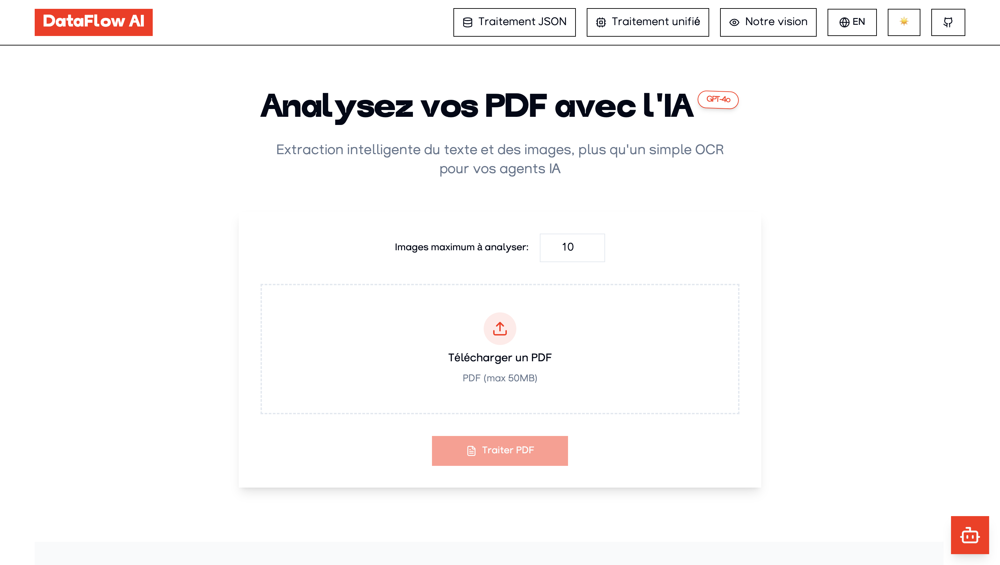
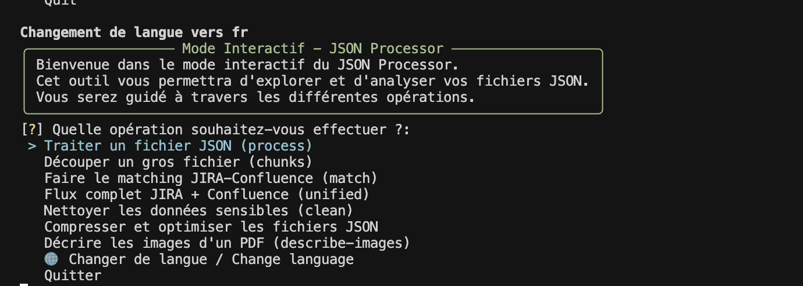
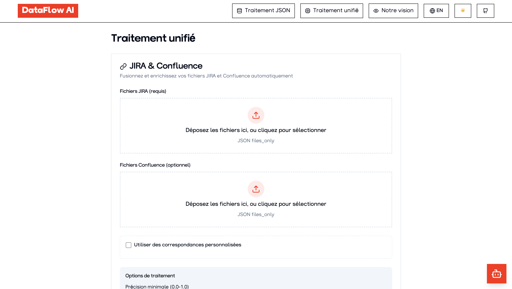

# DataFlow AI – Traitement intelligent de données pour les systèmes d'IA et RAG

  [](LICENSE)

> 🇬🇧 [English version available here](README.md)
> 📚 **Documentation complète disponible dans le dossier [`/documentation`](documentation/)**

## 📑 Présentation

DataFlow AI est une solution complète pour traiter, analyser et transformer des fichiers JSON et des documents PDF afin de les préparer pour les systèmes d'IA, le RAG (Retrieval Augmented Generation) et les bases de connaissances.



## 🚀 Fonctionnalités principales

- **Traitement intelligent de PDF** : Extraction de texte et analyse d'images avec GPT-4.1
- **Traitement JSON** : Détection automatique de structure, nettoyage et optimisation
- **Traitement unifié** : Mise en correspondance et enrichissement des fichiers JIRA et Confluence
- **Accès flexible** : Utilisation via l'interface web ou la CLI
- **Enrichissement LLM** : Amélioration des données avec analyse par IA
- **Sécurité intégrée** : Suppression automatique des données sensibles
- **Orchestration de tâches** : Gestion résiliente des tâches avec traitement PDF 86% plus rapide

## 🖥️ Démarrage rapide

### Utilisation de l'interface web

Pour une expérience conviviale, DataFlow AI propose une interface web moderne :

1. Démarrez l'API et le frontend :
```bash
docker-compose up -d
```

2. Accédez à l'interface sur http://localhost:80

3. Utilisez l'interface intuitive par glisser-déposer pour traiter vos fichiers



### Utilisation de la CLI interactive

Pour les utilisateurs avancés et l'automatisation, utilisez l'interface en ligne de commande interactive :

```bash
# Lancer le mode interactif avec assistant guidé
python -m cli.cli interactive

# Ou exécuter directement des commandes spécifiques
python -m cli.cli extract-images complete fichier.pdf --max-images 10
```

La CLI interactive offre une expérience guidée avec :
- Sélection de fichiers et dossiers via un navigateur interactif
- Accompagnement étape par étape pour toutes les opérations
- Résumés clairs avant chaque action
- Notifications détaillées à la fin de chaque processus



## 📋 Référence rapide

| Tâche | Interface Web | Commande CLI |
|------|---------------|-------------|
| **Traiter un PDF** | Téléversement sur la page d'accueil | `python -m cli.cli extract-images complete fichier.pdf` |
| **Traiter un JSON** | Onglet Traitement JSON | `python -m cli.cli process fichier.json --llm` |
| **Correspondance JIRA & Confluence** | Onglet Traitement unifié | `python -m cli.cli unified jira.json --confluence conf.json` |
| **Nettoyer les données sensibles** | Onglet Traitement JSON | `python -m cli.cli clean fichier.json` |

## 🧰 Outils disponibles

| Outil | Description | Web | CLI |
|------|-------------|-----|-----|
| **Extraction PDF** | Extraire du texte et analyser des images à partir de fichiers PDF | ✅ | ✅ |
| **Traitement JSON** | Traiter et structurer des données JSON | ✅ | ✅ |
| **Correspondance JIRA/Confluence** | Faire correspondre et enrichir les données entre sources | ✅ | ✅ |
| **Nettoyage de données** | Supprimer les informations sensibles | ✅ | ✅ |
| **Découpage en morceaux** | Diviser les grands fichiers en parties gérables | ✅ | ✅ |
| **Enrichissement LLM** | Améliorer les données avec l'analyse IA | ✅ | ✅ |
| **Compression** | Optimiser la taille des fichiers | ✅ | ✅ |
| **Traitement par lots** | Traiter plusieurs fichiers à la fois | ✅ | ✅ |
| **Assistant interactif** | Flux de travail guidé | ❌ | ✅ |

## 🔍 Pourquoi DataFlow AI ?

- **Détection intelligente de structure** : S'adapte automatiquement à toute structure JSON
- **Analyse PDF avancée** : Combine l'extraction de texte et l'analyse d'images par IA
- **Préservation des données** : Ne modifie jamais directement les fichiers source
- **Traitement robuste** : Gère automatiquement les erreurs et incohérences
- **Rapports détaillés** : Génère automatiquement des résumés complets
- **Sortie flexible** : Optimisée pour les systèmes RAG et les applications d'IA


## ⚙️ Installation

> ⚠️ **IMPORTANT** : DataFlow AI nécessite **Python 3.12** spécifiquement. Les autres versions (y compris les plus récentes) peuvent ne pas fonctionner correctement avec la bibliothèque Outlines.

### Démarrage rapide avec Docker

La façon la plus simple de démarrer avec l'API et l'interface web :

```bash
# Cloner le dépôt
git clone https://github.com/stranxik/dataflow-ai.git
cd dataflow-ai

# Créer les fichiers d'environnement
cp .env.example .env
cp frontend/.env.example frontend/.env

# Démarrer les services
docker-compose up -d
```

### Installation manuelle

Pour plus de contrôle ou à des fins de développement :

```bash
# Cloner et accéder au dépôt
git clone https://github.com/stranxik/dataflow-ai.git
cd dataflow-ai

# Créer un environnement virtuel avec Python 3.12
python3.12 -m venv venv
source venv/bin/activate  # Linux/macOS
# ou
venv\Scripts\activate     # Windows

# Configurer l'environnement
cp .env.example .env
# Modifier le fichier .env pour configurer vos paramètres

# Installer les dépendances
pip install -r requirements.txt

# Démarrer l'API
python run_api.py

# Dans un autre terminal, démarrer le frontend
cd frontend
npm install
npm run dev
```

> 📘 **Note** : Consultez le [guide d'installation complet](documentation/installation.fr.md) pour des instructions détaillées.

## 📚 Documentation

Une documentation complète est disponible dans le dossier `/documentation` :

- **[Documentation API](documentation/api/)** : Points d'accès API et utilisation
- **[Documentation CLI](documentation/cli/)** : Guide de l'interface en ligne de commande
- **[Documentation Frontend](documentation/frontend/)** : Manuel de l'interface web
- **[Traitement PDF](documentation/pdf/)** : Capacités d'extraction PDF
- **[Traitement JSON](documentation/extract/)** : Fonctionnalités de traitement JSON
- **[Sécurité](documentation/security/)** : Fonctionnalités de sécurité des données
- **[Orchestrateur de Tâches](documentation/orchestracteur/)** : Système avancé de gestion des tâches



## 🔒 Sécurité

DataFlow AI inclut des fonctionnalités pour protéger les données sensibles :

- Détection et suppression automatiques des clés API, identifiants et informations personnelles
- Traitement local des fichiers, sans stockage permanent
- Authentification par clé API pour tous les points d'accès

Pour plus d'informations, consultez la [documentation de sécurité](documentation/security/).

## 🐳 Déploiement Docker

DataFlow AI est conçu pour être facilement déployé avec Docker :

```bash
# Déployer tout
docker-compose up -d

# Exécuter des commandes CLI dans Docker
docker-compose run cli interactive
```

## 🇫🇷 Soutenir le projet

DataFlow-AI est un projet libre et ambitieux. Si vous l'utilisez et souhaitez soutenir son développement, vous pouvez faire un don via Ko-fi.  
Cela nous aide à maintenir le projet, à ajouter de nouvelles fonctionnalités et à répondre à vos retours plus rapidement.

[](https://ko-fi.com/stranxik)

Merci pour votre soutien, même symbolique 🙏

## 📜 Licence

Ce projet est distribué sous la Polyform Small Business License 1.0.0.

[](LICENSE)

Pour les détails complets de la licence, consultez le fichier [LICENSE](LICENSE).
