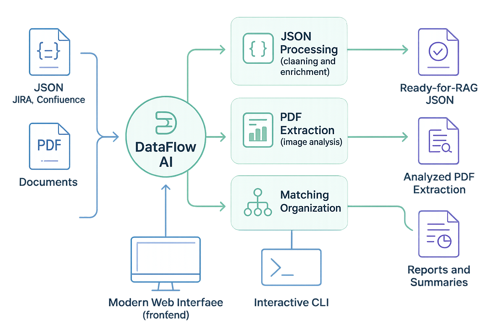
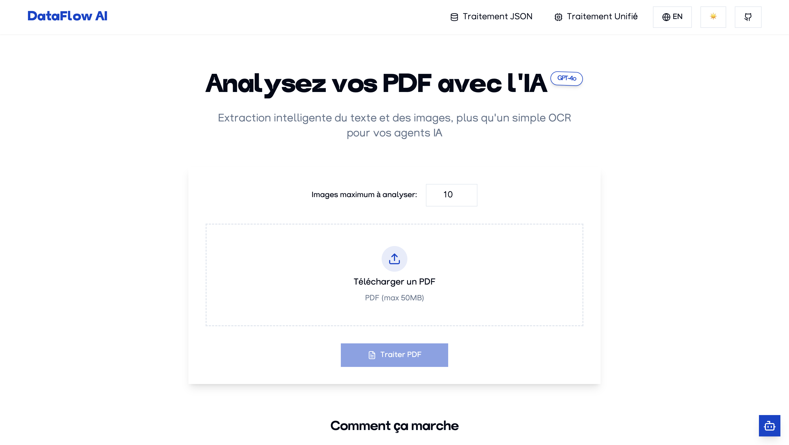
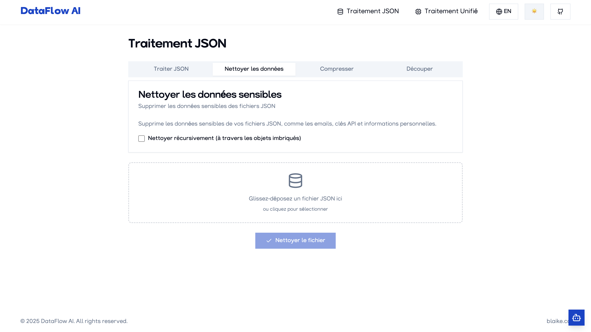
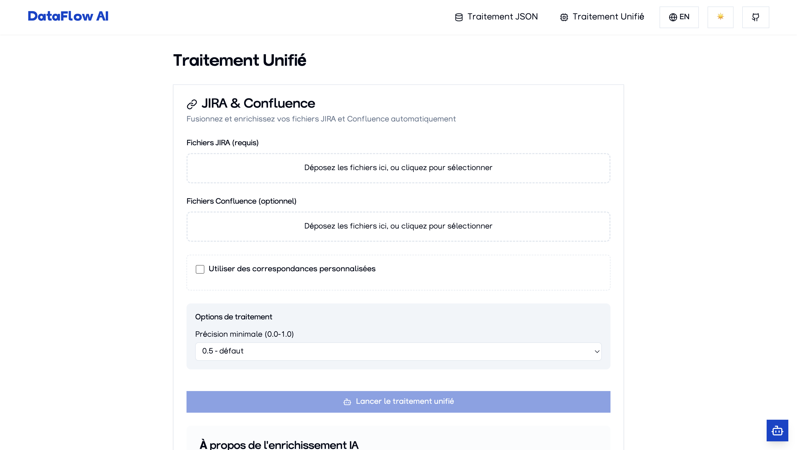

# DataFlow AI – Intelligent Data Processing for AI and RAG Systems

  

> 🌐 [Version française disponible ici](README.fr.md)
> 📚 **Complete documentation available in the [`/documentation`](documentation/) folder**

## 📑 Overview

DataFlow AI is a complete solution for processing, analyzing, and transforming JSON files and PDF documents to prepare them for AI systems, RAG (Retrieval Augmented Generation), and knowledge bases.



## 🚀 Key Features

- **Intelligent PDF Processing**: Extract text and analyze images with GPT-4o
- **JSON Processing**: Automatic structure detection, cleaning, and optimization
- **Unified Processing**: Match and enrich JIRA and Confluence files
- **Flexible Access**: Use either the web interface or the CLI
- **LLM Enrichment**: Enhance your data with AI-powered analysis
- **Security Built-in**: Automatic removal of sensitive data

## 🖥️ Getting Started

### Using the Web Interface

For a user-friendly experience, DataFlow AI provides a modern web interface:

1. Start the API and frontend:
```bash
docker-compose up -d
```

2. Access the interface at http://localhost:80

3. Use the intuitive drag-and-drop interface to process your files



### Using the Interactive CLI

For power users and automation, use the interactive command-line interface:

```bash
# Launch interactive mode with guided assistant
python -m cli.cli interactive

# Or directly run specific commands
python -m cli.cli extract-images complete file.pdf --max-images 10
```

## 📋 Quick Reference

| Task | Web Interface | CLI Command |
|------|---------------|-------------|
| **Process PDF** | Upload on Home page | `python -m cli.cli extract-images complete file.pdf` |
| **Process JSON** | JSON Processing tab | `python -m cli.cli process file.json --llm` |
| **Match JIRA & Confluence** | Unified Processing tab | `python -m cli.cli unified jira.json --confluence conf.json` |
| **Clean Sensitive Data** | JSON Processing tab | `python -m cli.cli clean file.json` |

## 🔍 Why DataFlow AI?

- **Intelligent Structure Detection**: Automatically adapts to any JSON structure
- **Advanced PDF Analysis**: Combines text extraction with AI image analysis
- **Data Preservation**: Never modifies source files directly
- **Robust Processing**: Handles errors and inconsistencies automatically
- **Detailed Reports**: Automatically generates comprehensive summaries
- **Flexible Output**: Optimized for RAG systems and AI applications



## ⚙️ Installation

> ⚠️ **IMPORTANT**: DataFlow AI requires **Python 3.12** specifically. Other versions (including newer ones) may not work correctly with the Outlines library.

### Quick Start with Docker

The easiest way to get started with both the API and web interface:

```bash
# Clone the repository
git clone https://github.com/stranxik/json_parser.git
cd json_parser

# Create environment files
cp .env.example .env
cp frontend/.env.example frontend/.env

# Start services
docker-compose up -d
```

### Manual Installation

For more control or development purposes:

```bash
# Clone and access the repository
git clone https://github.com/stranxik/json_parser.git
cd json_parser

# Create a virtual environment with Python 3.12
python3.12 -m venv venv
source venv/bin/activate  # Linux/macOS
# or
venv\Scripts\activate     # Windows

# Set up environment
cp .env.example .env
# Edit .env file to configure your settings

# Install dependencies
pip install -r requirements.txt

# Start the API
python run_api.py

# In another terminal, start the frontend
cd frontend
npm install
npm run dev
```

> 📘 **Note**: See the [complete installation guide](documentation/installation.md) for detailed instructions.

## 📚 Documentation

Comprehensive documentation is available in the `/documentation` folder:

- **[API Documentation](documentation/api/)**: API endpoints and usage
- **[CLI Documentation](documentation/cli/)**: Command-line interface guide
- **[Frontend Documentation](documentation/frontend/)**: Web interface manual
- **[PDF Processing](documentation/pdf/)**: PDF extraction capabilities
- **[JSON Processing](documentation/extract/)**: JSON handling features
- **[Security](documentation/security/)**: Data security features



## 🔒 Security

DataFlow AI includes features to protect sensitive data:

- Automatic detection and removal of API keys, credentials, and personal information
- Local processing of files, with no permanent storage
- API key authentication for all endpoints

For more information, see the [security documentation](documentation/security/).

## 🐳 Docker Deployment

DataFlow AI is designed to be easily deployed with Docker:

```bash
# Deploy everything
docker-compose up -d

# Run CLI commands in Docker
docker-compose run cli interactive
```

## 📜 License

This project is distributed under the MIT license.
